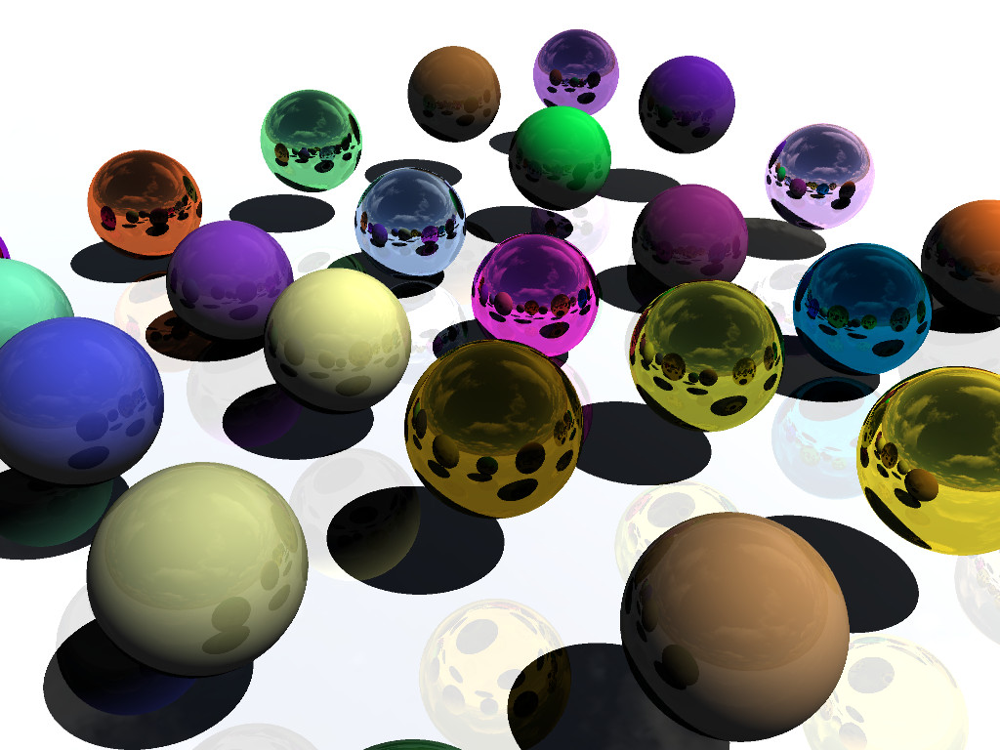

# vulkan-ray-tracing

## ✨ Overview

**VKRay** is a minimal yet extensible ray tracing engine developed using Vulkan.
The goal of this project is to understand path tracing and real-time acceleration structure management, all while keeping the architecture clean and modular.

This project serves as both a learning tool and a prototype engine for real-time global illumination experiments.



## ⚙️ Features

- Real-time ray tracing using Vulkan RT extensions
- Acceleration structures (BLAS / TLAS) for performance
- Dynamic scene updates and camera controls
- PBR materials and custom shading
- Clear separation of rendering pipeline stages
- Cross-platform CMake support

## 🚀 How to build
To compile this project, you will need the following libraries
- Vulkan
- GLFW
- [stb (for image loading)](https://github.com/nothings/stb)

### Getting `stb_image`

The project looks for `stb_image.h` inside `third_party/stb`. Clone the stb
repository (or add it as a submodule) so the header is available:

```bash
git clone https://github.com/nothings/stb.git third_party/stb
# or
git submodule add https://github.com/nothings/stb.git third_party/stb
git submodule update --init --recursive
```

Make sure `third_party/stb/stb_image.h` exists before configuring the project.

Run the following command to build the project
```
mkdir -p build
cd build
cmake ..
make
./vulkan_ray_tracer
```

## 🛠️ TODO List

* [x] Basic ray tracing on a sphere and a plane
* [x] Cubemap skybox
* [x] Sphere shading
* [x] Specular highlight and reflection
* [ ] Ray tracing on any geometric mesh
* [ ] User interface (potentially using ImGUI)
* [ ] Performances benchmarks 
* [ ] Denoising algorithm
* [ ] Phong shading and glossy effect
* [ ] Acceleration Structures
